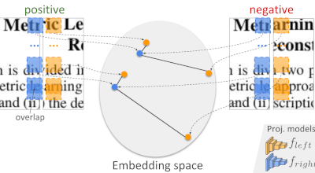
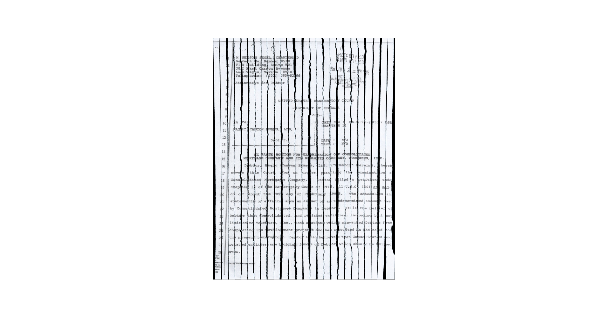

### Fast(er) Reconstruction of Shredded Text Documents via Self-Supervised Deep Asymmetric Metric Learning

This repository comprises datasets and source codes used in our [CVPR 2020 paper](https://openaccess.thecvf.com/content_CVPR_2020/papers/Paixao_Faster_Reconstruction_of_Shredded_Text_Documents_via_Self-Supervised_Deep_Asymmetric_CVPR_2020_paper.pdf).

#### Preparing the enviroment with virtualenv
Python dependencies are listed in requirements.txt. Optimization 3rd party dependencies include Concorde and QSopt.

For a fully-automatic setup of the virtual environment (tested on Linux Ubuntu 22.04), run `source scripts/install.sh`.

You should have sudo privileges to run properly the installation script. The virtual environment will be created at the root repository directory. When finished, the script will automatically activate the just created environment.

#### Download the datasets

The datasets comprise the (i) integral documents where the small samples are extracted and (ii) the mechanically-shredded documents collections D1 and D2 used in the tests. To download them, just run `bash scripts/get_dataset.sh`.

It will create a directory `datasets` in the local directory.

#### Demo

A reconstruction demo is available by running `python demo.py`. By default, the script uses a pretrained model available in the `traindata` directory. Here is an example of output of the demo script:

 For details of the parameters, you may run `python demo.py --help`.

#### Reproducing the experiments
To ease replicability, we created bash scripts with the commands used in each experiment. You can just run `bash scripts/experiment<ID>.sh` replacing `<ID>` by 1, 2, or 3. As described in the paper, each id corresponds to:

* 1: single-reconstruction experiment
* 2: multi-reconstruction experiment
* 3: sensitivity analysis

Results are stored as `.json` files containing, among other things, the solution, the initial permutation of the shreds, accuracy, and times. The files generated by the experiments 1 and 3 are at `results/proposed` and `results/sib18`, while those generated by the experiment 2 are at `results/proposed_multi` and `results/sib18_multi`. Results can be visualized through the scripts in the `charts` directory`.
